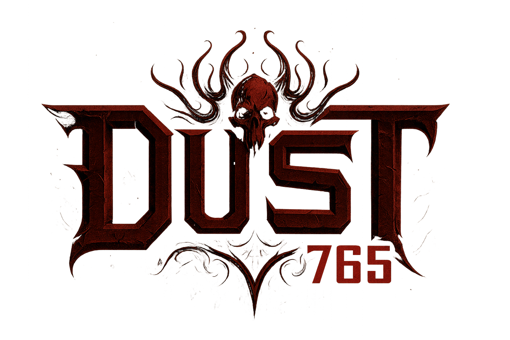

<div align="center">
  

  [](https://dotnet.microsoft.com/download/dotnet-framework/net48)
  [](https://github.com/FNA-XNA/FNA)
  [](https://github.com/andreakarasho/ClassicUO)
  [](https://discord.gg/9Vh7aqqX)
  [](LICENSE.md)

</div>

## 🎭 **The Dust765 Project**

> **"This project was created to address a problem constructed within the toxicity of this community. This is to show the community that open source projects are not meant for cliques and high school drama but rather the expansion of something greater: innovation."**
>
> *- A penny for your thoughts, the adder that prays beneath the rose.*

### 🌑 **The Dark Truth**

Welcome to the **Dust765** project - where we don't just break barriers, we **obliterate them**. While others play nice in their little sandboxes, we're here to remind everyone that **true innovation doesn't come from playing favorites**.

[**Discord**](https://discord.gg/9Vh7aqqX) – We're on our own Discord server, join and have fun!

Dust765: 7 Link, 6 Gaechti, 5 Syrupz and jsebold666 (astraroth)

**What makes us different?**

- 🚫 **No Cliques** - We don't care about your "elite" status or who you know
- 🌍 **No Platform Discrimination** - Windows, Linux, macOS - we treat them all equally
- 🔥 **No Drama** - Leave your high school mentality at the door
- 💀 **Pure Innovation** - We're here to build, not to gossip

### 🎯 **The Mission**

The **Dust765** project isn't just another UO client. It's a **statement**. A statement that says:

> *"We're tired of the toxic communities, the exclusive groups, and the drama that plagues open source projects. We're here to show that real innovation comes from collaboration, not from who you know or what platform you use."*

## 🚀 **What We've Built**

### ✨ **Cross-Platform Domination**

- **Windows x64** - Because even Windows users deserve quality
- **Linux x64** - For the penguin lovers who got tired of being ignored
- **macOS x64** - Because Apple users are people too

### 🛠️ **Cutting-Edge Technology**

- **.NET Framework 4.8** - Stable and reliable (proven technology)
- **Mono Support** - Cross-platform compatibility through Mono runtime
- **Native Libraries** - Optimized for each platform (because we actually care)
- **Multi-Platform** - Windows, Linux, and macOS support

### 🎮 **The Complete Experience**

- **Modern UI** - Because 1997 called, and we hung up
- **High Performance** - Optimized for modern hardware (not your grandma's Pentium)
- **Full Compatibility** - Works with all UO servers (even the sketchy ones)
- **Advanced Features** - Macros, tooltips, nameplates, and more (because we're not lazy)

## 📦 **Downloads**

### 🎯 **Automated Builds**

Our builds are generated automatically (unlike some projects that require a blood sacrifice):

- **Windows**: `ClassicUO-Windows-x64.zip`
- **Linux**: `ClassicUO-Linux-x64.tar.gz`
- **macOS**: `ClassicUO-macOS-x64.tar.gz`

### 🔄 **CI/CD That Actually Works**

- ✅ **Automatic Building** - Every commit, every platform
- ✅ **Multi-Platform Testing** - We test on Windows, Linux, and macOS
- ✅ **Automatic Deployment** - Releases created without human intervention
- ✅ **Separate Artifacts** - Downloads organized by platform (because we're not savages)

## 🛠️ **Development**

### 📋 **Prerequisites**

- [.NET Framework 4.8](https://dotnet.microsoft.com/download/dotnet-framework/net48) (for Windows)
- [Mono](https://www.mono-project.com/download/stable/) (for Linux/macOS)
- Git (for cloning, not for drama)
- Visual Studio 2022 / VS Code / Rider (optional, but recommended)

### 🏗️ **Local Build**

```bash
# Clone the repository (the right way)
git clone https://github.com/dust765/ClassicUO.git
cd ClassicUO

# Initialize submodules (because we use them properly)
git submodule update --init --recursive

# Build for all platforms (because we're not lazy)
dotnet build

# Build with .NET Framework 4.8 (Windows)
dotnet build src/ClassicUO.Client/ClassicUO.Client.csproj -c Release

# Build with Mono (Linux/macOS)
mono mscorlib.dll
```

### 🧪 **Build Scripts**

- **Windows**: `scripts\build-cross-platform.cmd`
- **Linux/macOS**: `scripts/build-cross-platform.sh`


### 💡 **How to Contribute**

1. **Fork** the repository (the right way)
2. **Create** a feature branch (`git checkout -b feature/AmazingFeature`)
3. **Commit** your changes (`git commit -m 'Add some AmazingFeature'`)
4. **Push** to the branch (`git push origin feature/AmazingFeature`)
5. **Open** a Pull Request (and be prepared for real feedback)

### 🐛 **Reporting Bugs**

- Use the [Issues](../../issues) system (not Discord DMs)
- Include platform information (because we're not mind readers)
- Attach error logs (because "it doesn't work" isn't helpful)
- Describe reproduction steps (because we can't read your mind)

### 💬 **Discussions**

- [GitHub Discussions](../../discussions) for ideas and suggestions
- [Discord](https://discord.gg/kjzFEEyD) for real-time chat (but keep it civil)


## 📜 **License**

This project is licensed under the MIT License - see the [LICENSE.md](LICENSE.md) file for details.

## 🙏 **Acknowledgments**

- **andreakarasho** - Original creator of ClassicUO (the real MVP)
- **Gaechti** - Best cheater
- Supoorts Marcos Guerine and Lissandro
- **FNA Team** - Cross-platform graphics engine (the unsung heroes)
- **UO Community** - For the feedback and support (even the toxic parts)
- **Contributors** - Everyone who helped make this project possible

## 📚 Features Documentation

For a full list of features and options (Art/Hue changes, Visual Helpers, HealthBars, Cursor, Macros, Gumps, Auto Loot, Buffbar, and more), see:

- **[Dust765 Wiki](https://github.com/dust765/ClassicUO/wiki)**

### How to Use Options

1. **Modern Options**: In-game, open **Options** (Modern Options gump).
2. **Side menu**: Use the left sidebar to switch between **General**, **Sound**, **Video**, **Macros**, **Tooltips**, **Speech**, **Combat & Spells**, **Counters**, **Infobar**, **Action Bar**, **Containers**, **Nameplate Options**, **Cooldown bars**, **TazUO Specific**, **Dust765**, and **Experimental**.
3. **Sub-sections**: Inside each category, the left panel shows sub-sections (e.g. under General: General, Mobiles, Gumps & Context, Misc, Terrain & Statics).
4. **Search**: Use the search box at the top to find options by name.
5. **Save**: Settings are saved automatically to your profile.

### Usage Tips

- **Test Gradually**: Enable features one at a time to understand their effects
- **Backup Settings**: Backup settings before major changes
- **Performance**: Some features may impact performance
- **Compatibility**: Check compatibility with your UO server

---


### 🎥 **Demonstration Videos**

- [Part 1 - Introduction](https://youtu.be/aqHiiOhx8Q8)
- [Part 2 - Features](https://youtu.be/P7YBrI3s6ZI)
- [Part 3 - Cross-Platform](https://youtu.be/074Osj1Fcrg)

---


🌟 If this project helped you, consider giving it a ⭐ on the repository! 🌟

"Innovation doesn't come from cliques, but from true collaboration."

🎭 The Dust765 Project - Breaking Barriers, Building Bridges 🎭

